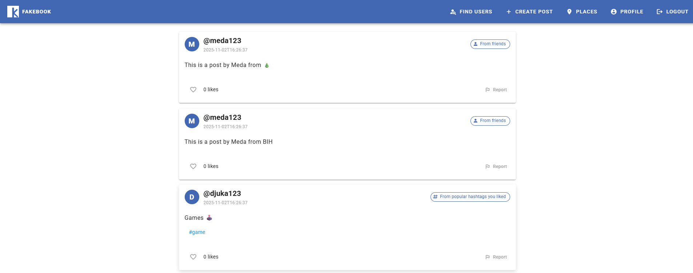
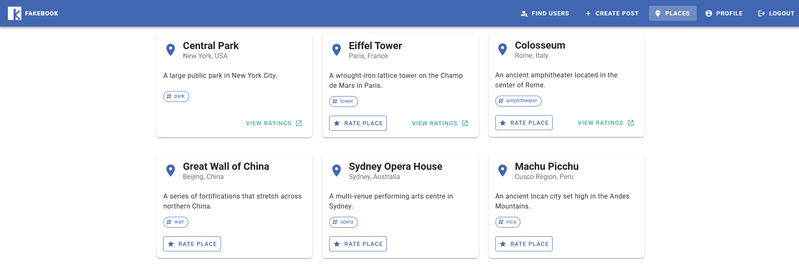

# Fakebook

A full-stack social media platform with posts, friendships, and place reviews. Features intelligent content moderation using a Drools rules engine that automatically filters feeds, flags problematic users, and manages content based on configurable business rules.

## Screenshots

### Home Feed


### Places


## Features

- User authentication (JWT), profiles, blocking, and reporting
- Friend requests and management
- Post creation, feeds, likes, and moderation
- Places with rating system
- Rule-based content filtering and automatic user flagging

## Tech Stack

- **Frontend**: Vuetify 3, Vite
- **Backend**: Node.js, Express (REST API), Sequelize ORM, JWT
- **KIE Service**: Spring Boot 3.2.5, Drools 8.44.0 (rules engine), Java 17
- **Database**: PostgreSQL 16

## Quick Start

1. **Run with Docker**
   ```bash
   docker compose up --build -d
   ```

2. **Access**
   - Frontend: http://localhost:8080
   - Backend: http://localhost:3000
   - KIE Service: http://localhost:8085

3. **Stop**
   ```bash
   docker compose down
   ```